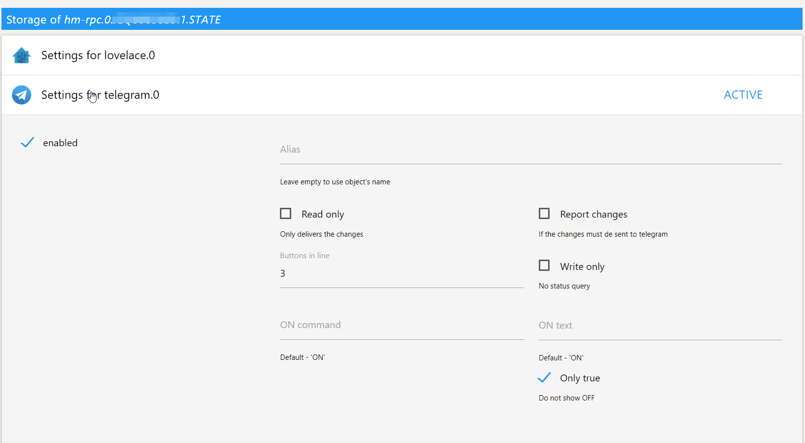
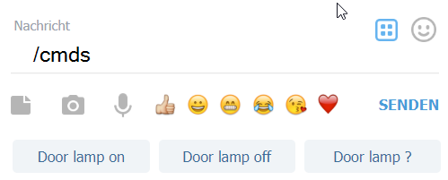
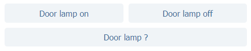
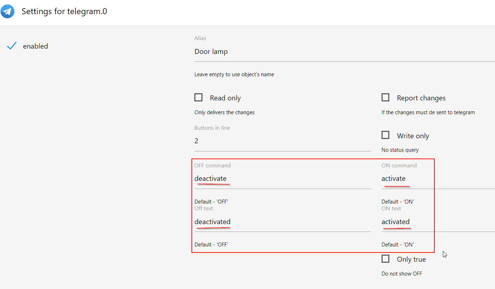

# ioBroker.telegram

## Konfiguration

Bitte [@BotFather](https://telegram.me/botfather) mit `/newbot`, einen neuen Bot anzulegen.

Du wirst nach dem Namen des Bots und danach nach dem Benutzernamen gefragt.
Anschließend erhältst du den Token.


Im Konfigurationsdialog solltest du ein Passwort für die Kommunikation setzen. Danach den Adapter starten.

Um eine Unterhaltung mit deinem Bot zu beginnen, musst du den Benutzer mit `/password phrase` authentifizieren, wobei **`phrase`** das konfigurierte Passwort ist. Öffne also in Telegram eine neue Unterhaltung mit dem erzeugten Bot und gib als ersten Befehl das Passwort ein.

**Hinweis:** Du kannst auch die Kurzform `/p phrase` verwenden.

Um dem Bot ein schönes Profilbild zu geben, gib im Chat mit **BotFather** `/setuserpic` ein und lade das gewünschte Bild (512x512 Pixel) hoch, z. B. dieses [Logo](../en/img/logo.png).

Du kannst eine Nachricht über die messageBox an alle authentifizierten Benutzer senden: `sendTo('telegram', 'Test message')`
oder an einen bestimmten Benutzer: `sendTo('telegram', '@userName Test message')`.
Der Benutzer muss vorher authentifiziert sein.

Der Benutzer kann auch so angegeben werden:

```javascript
sendTo('telegram', {user: 'UserName', text: 'Test message'}, function (res) {
    console.log('Sent to ' + res + ' users');
});
```

Beachte bei diesem Beispiel, dass du 'UserName' entweder durch den Vornamen oder durch den öffentlichen Telegram-Benutzernamen des Empfängers ersetzen musst (abhängig davon, ob in den Adapter-Einstellungen die Option „Benutzernamen statt Vornamen speichern" aktiviert ist).
Ist die Option gesetzt und der Benutzer hat in seinem Telegram-Konto keinen öffentlichen Benutzernamen hinterlegt, verwendet der Adapter weiterhin den Vornamen. Legt der Benutzer später (nach der Authentifizierung am Bot) einen öffentlichen Benutzernamen fest, wird der gespeicherte Vorname beim nächsten Senden einer Nachricht an den Bot durch den Benutzernamen ersetzt.

Es können mehrere Empfänger angegeben werden (die Benutzernamen einfach durch Komma trennen).
Beispiel: Empfänger `"User1,User4,User5"`

Eine Nachricht kann auch über einen Zustand gesendet werden: Setze dazu den Zustand *"telegram.INSTANCE.communicate.response"* auf den Wert *"@userName Test message"* oder auf ein JSON-Objekt:

```json
{
    "text": "Test message"
}
```

Die JSON-Schreibweise erlaubt zusätzlich Optionen aus der [Telegram Bot API](https://core.telegram.org/bots/api) sowie die Angabe von Benutzer oder chatId:

```json
{
    "text": "Test message, but with *bold*",
    "parse_mode": "Markdown",
    "chatId": "1234567890",
    "user": "UserName"
}
```

Der `parse_mode` kann auch direkt im Text gesetzt werden:

```
sendTo('telegram', {user: 'UserName', text: '<MarkdownV2>Test message, but with *bold*</MarkdownV2>'}, function (res) {
   console.log('Sent to ' + res + ' users');
});
```

oder
```
setState('telegram.0.communicate.response', '<MarkdownV2>Test message, but with *bold*</MarkdownV2>');
```

Um Nachrichten in Gruppen zu senden, musst du den Bot in die Gruppe einladen, in der er schreiben soll.
Durch Angabe der `chat_id` im JSON der Nachricht kannst du dann Nachrichten in diese Gruppen senden.

Um die `chat_id` herauszufinden, setze die Log-Stufe des Adapters auf `debug`.
Schreibe den Bot dann in den Gruppen an, in die er senden soll.
Achte darauf, ein `/` vor die Nachricht zu setzen, damit der Bot die Nachricht sieht ([falls der Privacy-Modus des Bots aktiv ist](#nachrichten-aus-gruppenchats-mit-dem-telegram-adapter-empfangen)).
Im ioBroker-Log erscheint dann die Chat-ID.

## Verwendung
Telegram kann zusammen mit dem Adapter [text2command](https://github.com/ioBroker/ioBroker.text2command) verwendet werden. Es gibt ein vordefiniertes Kommunikationsschema, mit dem du dein Haus in Textform steuern kannst.

Um ein Foto zu senden, übergib statt eines Textes einfach einen Dateipfad oder eine URL: `sendTo('telegram', 'absolute/path/file.png')` oder `sendTo('telegram', 'https://telegram.org/img/t_logo.png')`.

Beispiel, wie ein Schnappschuss einer Webcam an Telegram gesendet wird:

```javascript
function sendImage() {
    httpGet('https://raw.githubusercontent.com/ioBroker/ioBroker.javascript/master/admin/javascript.png', { responseType: 'arraybuffer' }, async (err, response) => {
        if (err) {
            console.error(err);
        } else {
            const tempFilePath = createTempFile('telegram-image.png', response.data);

            sendTo('telegram.0', 'send', {
                text: tempFilePath,
                caption: 'A wonderful adapter',
                user: 'yourUserName1,yourUserName2',
            });
        }
    });
}

on('0_userdata.0.someState', (obj) => {
    if (obj.state.val) {
        // send 4 images: immediately, in 5, 15 and 30 seconds
        sendImage();
        setTimeout(sendImage, 5000);
        setTimeout(sendImage, 15000);
        setTimeout(sendImage, 30000);
    }
});
```

Die folgenden Nachrichten sind für Aktionen reserviert:

- *typing* - für Textnachrichten,
- *upload_photo* - für Fotos,
- *upload_video* - für Videos,
- *record_video* - für Videos,
- *record_audio* - für Audio,
- *upload_audio* - für Audio,
- *upload_document* - für Dokumente,
- *find_location* - für Standortdaten

In diesem Fall wird das Aktionskommando gesendet.

Die Beschreibung der Telegram-API findest du [hier](https://core.telegram.org/bots/api). Alle dort definierten Optionen können verwendet werden, indem sie dem Sende-Objekt hinzugefügt werden. Z. B.:

```javascript
sendTo('telegram.0', 'send', {
    text:                   '/tmp/snap.jpg',
    caption:                'Snapshot',
    disable_notification:   true
});
```

**Mögliche Optionen**:
- *disable_notification*: Sendet die Nachricht lautlos. iOS-Benutzer erhalten keine Benachrichtigung, Android-Benutzer eine Benachrichtigung ohne Ton. (alle Typen)
- *parse_mode*: Markdown oder HTML senden, wenn Telegram-Apps fett, kursiv, Festbreitenschrift oder Inline-URLs in der Nachricht anzeigen sollen. Mögliche Werte: "Markdown", "MarkdownV2", "HTML" (message)
- *disable_web_page_preview*: Deaktiviert Link-Vorschauen für Links in dieser Nachricht (message)
- *caption*: Bildunterschrift für Dokument, Foto oder Video, 0-200 Zeichen (video, audio, photo, document)
- *duration*: Dauer des gesendeten Videos oder Audios in Sekunden (audio, video)
- *performer*: Interpret der Audiodatei (audio)
- *title*: Titel der Audiodatei (audio)
- *width*: Videobreite (video)
- *height*: Videohöhe (video)

Der Adapter versucht, den Nachrichtentyp (photo, video, audio, document, sticker, action, location) anhand des Textes zu erkennen: Ist der Text der Pfad zu einer vorhandenen Datei, wird sie entsprechend ihrem Typ gesendet.

Ein Standort wird an den Attributen `latitude` und `longitude` erkannt:

```javascript
sendTo('telegram.0', 'send', {
    latitude:               52.522430,
    longitude:              13.372234,
    disable_notification:   true
});
```

Ein Veranstaltungsort (Venue) wird an den Attributen `latitude`, `longitude`, `title` und `address` erkannt:

```javascript
sendTo('telegram.0', 'send', {
    latitude:               52.51630462381893,
    longitude:              13.37770039691943,
    title:                  'Brandenburger Tor',
    address:                'Pariser Platz 8, 10117 Berlin',
});
```

### Explizite Nachrichtentypen
Du kannst den Nachrichtentyp zusätzlich explizit angeben, wenn die Daten als Buffer gesendet werden sollen.

Folgende Typen sind möglich: *sticker*, *video*, *document*, *audio*, *photo*.

```javascript
sendTo('telegram.0', 'send', {
    text: fs.readFileSync('/opt/path/picture.png'),
    type: 'photo'
});
```

### Dateien aus dem ioBroker-Dateispeicher oder aus Zuständen senden (iob://-URIs)
Neben einem lokalen Dateipfad oder einer Web-URL kann `text` auch eine **ioBroker-URI** sein. Der Adapter löst die URI auf, liest den Inhalt und sendet ihn mit dem automatisch erkannten Medientyp (photo, video, audio, document, ...). Das ist besonders nützlich, wenn die Datei im ioBroker-Dateispeicher hinter Redis/jsonl liegt und damit **nicht** im lokalen Dateisystem existiert – ein einfacher Pfad würde dort nicht funktionieren.

Folgende Schemata werden unterstützt:

- `iobfile://<adapter.instance>/<path>` — eine Datei aus dem ioBroker-Dateispeicher.
- `iobstate://<state.id>` — der Wert eines Zustands (siehe unten, wie der Wert interpretiert wird).
- `iobobject://<object.id>/<path>` — ein Wert innerhalb eines ioBroker-Objekts (`path` navigiert mit `/` in das Objekt hinein).

```javascript
// send a snapshot that another adapter has written into the file storage
sendTo('telegram.0', 'send', {
    user: 'UserName',
    text: 'iobfile://cameras.0/snapshots/front_door.jpg',
    caption: 'Someone is at the front door',
});

// send a file whose full path is stored in a state
sendTo('telegram.0', 'send', {
    text: 'iobstate://0_userdata.0.lastReport',
});

// take a value out of an object
sendTo('telegram.0', 'send', {
    text: 'iobobject://0_userdata.0.myObject/native/document',
});
```

Der Medientyp wird aus der Dateiendung abgeleitet (`.jpg`/`.png` → photo, `.mp4` → video, `.mp3`/`.ogg`/`.wav` → audio, `.gif` → animation, `.webp` → sticker, `.pdf`/`.csv`/`.docx`/... → document). Bei unbekannter Endung wird der Typ aus dem gespeicherten MIME-Typ ermittelt; als Rückfall wird der Inhalt als Dokument gesendet. Mit der Option `type` kann der Typ weiterhin explizit vorgegeben werden.

**Wie ein Zustands-/Objektwert interpretiert wird** (`iobstate://` und `iobobject://`):
- eine **Data-URL** (`data:image/png;base64,...`) wird dekodiert und mit dem entsprechenden Medientyp gesendet;
- ein Wert, der selbst eine `iob*://`-URI oder eine `http(s)://`-URL ist, wird weiter aufgelöst (bis zu 5 Verschachtelungsebenen);
- jede andere Zeichenkette wird als Dateipfad/URL behandelt;
- Zahlen, Booleans und Objekte werden als Text gesendet (Objekte als JSON).

### Tastatur
Du kannst im Client eine Tastatur **ReplyKeyboardMarkup** anzeigen:

```javascript
sendTo('telegram.0', 'send', {
    text: 'Press button',
    reply_markup: {
        keyboard: [
            ['Line 1, Button 1', 'Line 1, Button 2'],
            ['Line 2, Button 3', 'Line 2, Button 4']
        ],
        resize_keyboard:   true,
        one_time_keyboard: true
    }
});
```

Mehr dazu [hier](https://core.telegram.org/bots/api#replykeyboardmarkup) und [hier](https://core.telegram.org/bots#keyboards).

Du kannst im Client eine Tastatur **InlineKeyboardMarkup** anzeigen:

```javascript
sendTo('telegram', 'send', {
    user: 'my_username;username2', // optional. Separator could be ";" or "," or space
    text: 'Click the button',
    reply_markup: {
        inline_keyboard: [
            [{ text: 'Button 1_1', callback_data: '1_1' }],
            [{ text: 'Button 1_2', callback_data: '1_2' }]
        ]
    }
});
```

Mehr dazu [hier](https://core.telegram.org/bots/api#inlinekeyboardmarkup) und [hier](https://core.telegram.org/bots#inline-keyboards-and-on-the-fly-updating).

**HINWEIS:** *Nachdem der Benutzer eine Callback-Schaltfläche gedrückt hat, zeigen Telegram-Clients einen Fortschrittsbalken an, bis du answerCallbackQuery aufrufst. Du musst deshalb mit answerCallbackQuery reagieren, auch wenn keine Benachrichtigung an den Benutzer nötig ist (z. B. ohne einen der optionalen Parameter anzugeben).*

### answerCallbackQuery
Mit dieser Methode werden Antworten auf Callback-Anfragen von Inline-Tastaturen gesendet. Die Antwort wird dem Benutzer als Benachrichtigung am oberen Rand des Chats oder als Alarm angezeigt. Bei Erfolg wird *True* zurückgegeben.

```javascript
if (command === '1_2') {
    sendTo('telegram', 'send', {
     user: 'my_username username2', // optional. Separator could be ";" or "," or space
        answerCallbackQuery: {
            text: 'Pressed!',
            showAlert: false, // Optional parameter
        },
   });
}
```

Mehr dazu [hier](https://core.telegram.org/bots/api#answercallbackquery).

### Frage
Du kannst eine Nachricht an Telegram senden und die nächste Antwort wird im Callback zurückgegeben.
Das Antwort-Timeout wird in der Instanz-Konfiguration eingestellt (Standard: 60 Sekunden). Antwortet der Benutzer
nicht rechtzeitig, wird der Callback mit der **Zeichenkette** `'__timeout__'` aufgerufen (`msg.data` ist dann `undefined`).

```javascript
sendTo('telegram.0', 'ask', {
    user: user, // optional
    text: 'Are you sure?',
    reply_markup: {
        inline_keyboard: [
            // two buttons could be on one line too, but here they are on different
            [{ text: 'Yes!',  callback_data: '1' }], // first line
            [{ text: 'No...', callback_data: '0' }]  // second line
        ]
    }
}, msg => {
    if (msg === '__timeout__') {
        console.log('no answer within the configured timeout');
    } else if (msg.data === '1') {
        console.log('user pressed Yes');
    } else {
        console.log('user pressed No');
    }
});
```

**Wichtig – der Aufrufer hat sein eigenes `sendTo`-Timeout:** Der Adapter, der das `ask` sendet (z. B. der
JavaScript-Adapter), wendet auf den `sendTo`-Callback sein **eigenes** Timeout an; im JavaScript-Adapter sind das
standardmäßig etwa **20 Sekunden**. Ist das konfigurierte Antwort-Timeout länger, wird der Callback vom *Aufrufer*
vorzeitig mit einem Timeout-Ergebnis ausgelöst – was so aussieht, als hätte der Benutzer „Nein" geantwortet.
Erhöhe das Timeout des Aufrufers, sodass es **größer** als das Antwort-Timeout ist, z. B. im JavaScript-Adapter
über das letzte Argument:

```javascript
sendTo('telegram.0', 'ask', {
    text: 'Are you sure?',
    reply_markup: { inline_keyboard: [[{ text: 'Yes!', callback_data: '1' }], [{ text: 'No...', callback_data: '0' }]] }
}, msg => {
    // ... handle msg (see above)
}, { timeout: 65000 }); // must be > the configured answer timeout (here 60 s)
```

## Chat-ID
Seit Version 0.4.0 kann eine Chat-ID verwendet werden, um Nachrichten in einen Chat zu senden.

```javascript
sendTo('telegram.0', 'send', {
    text: 'Message to chat',
    chatId: 'SOME-CHAT-ID-123'
});
```

## Thread-ID
Für Supergruppen kann zusätzlich eine Thread-ID gesetzt werden.

```javascript
sendTo('telegram.0', 'send', {
    text: 'Message to chat',
    chatId: 'SOME-CHAT-ID-123',
    message_thread_id: 7,
});
```

## Standort empfangen
Teilt ein Benutzer dem Bot einen Standort mit (Büroklammer → Standort) oder sendet er einen Veranstaltungsort, werden die Koordinaten als Zeichenkette `latitude;longitude` (Rolle `value.gps`) in den Zustand `telegram.INSTANCE.communicate.requestLocation` geschrieben. Die Metadaten-Zustände (`requestChatId`, `requestMessageId`, `requestUserId`) werden ebenfalls aktualisiert, damit bekannt ist, wer den Standort gesendet hat.

```javascript
on({ id: 'telegram.0.communicate.requestLocation', change: 'any' }, obj => {
    const [latitude, longitude] = obj.state.val.split(';').map(parseFloat);
    const user = getState('telegram.0.communicate.requestUserId').val;
    console.log(`User ${user} is at ${latitude}, ${longitude}`);
    // e.g. forward the coordinates to a map widget
});
```

Live-Standorte (Büroklammer → Standort → „Live-Standort teilen") werden ebenfalls unterstützt: Telegram liefert jede Positionsaktualisierung und `requestLocation` wird jedes Mal aktualisiert. Drei weitere Zustände beschreiben den zuletzt empfangenen Standort:

- `communicate.requestLocationLive` - `true`, solange es sich um einen Live-Standort handelt, der noch geteilt wird. Wird das Teilen beendet oder läuft es ab, sendet Telegram eine letzte Aktualisierung ohne Live-Kennzeichen, und der Zustand fällt auf `false` zurück. Bei einem normalen (statischen) Standort oder einem Veranstaltungsort ist er `false`.
- `communicate.requestLocationHeading` - Bewegungsrichtung in Grad (1-360). Nur bei aktiven Live-Standorten verfügbar und nur, wenn das Gerät sie meldet, sonst `null`.
- `communicate.requestLocationAccuracy` - Unsicherheitsradius der Position in Metern (0-1500), falls gemeldet, sonst `null`.

```javascript
on({ id: 'telegram.0.communicate.requestLocationLive', change: 'ne' }, obj => {
    if (!obj.state.val) {
        console.log('Live location sharing has ended');
    }
});
```

## Kanalbeiträge empfangen
Ist der Bot Administrator eines Kanals, werden auch die in diesem Kanal veröffentlichten Beiträge empfangen und in
der Form `[Kanaltitel]Text` nach `telegram.INSTANCE.communicate.request` geschrieben (zusammen mit
`communicate.requestChatId` und `communicate.requestMessageId`). Kanalbeiträge sind anonym (sie haben keinen
absendenden Benutzer), daher greifen Authentifizierung und Befehlsverarbeitung bei ihnen nicht – sie werden nur als
Anfrage bereitgestellt. Angehängte Medien werden wie bei normalen Nachrichten gespeichert, und der Kanal wird in
`communicate.chats` aufgenommen.

## Bekannte Chats und Gruppen
Jeder Chat und jede Gruppe, aus der der Bot eine Nachricht erhält, wird im Zustand
`telegram.INSTANCE.communicate.chats` als JSON-Objekt `id => { title, type }` gemerkt (`type` ist einer von
`private`, `group`, `supergroup` oder `channel`). Das ist praktisch, um die Chat-ID einer Gruppe nachzuschlagen (z. B.
damit ein anderer Adapter eine Zielgruppe auswählen kann). Füge den Bot der Gruppe hinzu und sende eine Nachricht,
damit die Gruppe erscheint.

```json
{
    "1234567": { "title": "John Doe", "type": "private" },
    "-1001234567890": { "title": "My smart home group", "type": "supergroup" }
}
```

Die Liste wird dauerhaft gespeichert und übersteht einen Neustart des Adapters. Verwende die Chat-ID beim Senden als `chatId`:

```javascript
sendTo('telegram.0', 'send', { text: 'Hello group', chatId: '-1001234567890' });
```

## Nachrichten aktualisieren
Mit den folgenden Methoden kann eine vorhandene Nachricht im Verlauf geändert werden, statt als Ergebnis einer Aktion eine neue zu senden. Das ist vor allem bei Nachrichten mit *Inline-Tastaturen* und Callback-Anfragen nützlich, hilft aber auch, Unterhaltungen mit gewöhnlichen Chat-Bots übersichtlich zu halten.

### editMessageText
Mit dieser Methode wird ein vom Bot (oder über den Bot, bei Inline-Bots) gesendeter Text bearbeitet. Bei Erfolg wird die bearbeitete Nachricht zurückgegeben, wenn sie vom Bot gesendet wurde, andernfalls *True*.

```javascript
if (command === '1_2') {
    sendTo('telegram', {
        user: user,
        text: 'New text before buttons',
        editMessageText: {
            options: {
                chat_id: getState('telegram.0.communicate.requestChatId').val,
                message_id: getState('telegram.0.communicate.requestMessageId').val,
                reply_markup: {
                    inline_keyboard: [
                        [{ text: 'Button 1', callback_data: '2_1' }],
                        [{ text: 'Button 2', callback_data: '2_2' }]
                    ],
                }
            }
        }
    });
}
```

*oder neuer Text für die letzte Nachricht:*

```javascript
if (command === '1_2') {
    sendTo('telegram', {
        user: user,
        text: 'New text message',
        editMessageText: {
            options: {
                chat_id: getState('telegram.0.communicate.requestChatId').val,
                message_id: getState('telegram.0.communicate.requestMessageId').val,
            }
        }
    });
}
```

Mehr dazu [hier](https://core.telegram.org/bots/api#editmessagetext).

### editMessageCaption
Mit dieser Methode wird die Bildunterschrift einer vom Bot (oder über den Bot, bei Inline-Bots) gesendeten Nachricht bearbeitet.
Bei Erfolg wird die bearbeitete Nachricht zurückgegeben, wenn sie vom Bot gesendet wurde, andernfalls *True*.

```javascript
if (command === '1_2') {
    sendTo('telegram', {
        user, // optional
        text: 'New caption',
        editMessageCaption: {
            options: {
                chat_id: getState('telegram.0.communicate.requestChatId').val,
                message_id: getState('telegram.0.communicate.requestMessageId').val
            }
        }
    });
}
```

Mehr dazu [hier](https://core.telegram.org/bots/api#editmessagecaption).

### editMessageMedia
Mit dieser Methode wird das Bild einer vom Bot (oder über den Bot, bei Inline-Bots) gesendeten Nachricht ausgetauscht.
Bei Erfolg wird die bearbeitete Nachricht zurückgegeben, wenn sie vom Bot gesendet wurde, andernfalls *True*.

```javascript
if (command === '1_2') {
    sendTo('telegram', {
        user, // optional
        text: 'picture.jpg',
        editMessageMedia: {
            options: {
                chat_id: (await getStateAsync('telegram.0.communicate.botSendChatId')).val,
                message_id: (await getStateAsync('telegram.0.communicate.botSendMessageId')).val
            }
        }
    });
}
```

Unterstützt werden folgende Medientypen: `photo`, `animation`, `audio`, `document`, `video`.

Mehr dazu [hier](https://core.telegram.org/bots/api#editmessagemedia).

### editMessageReplyMarkup
Mit dieser Methode wird nur das Reply-Markup einer vom Bot (oder über den Bot, bei Inline-Bots) gesendeten Nachricht bearbeitet. Bei Erfolg wird die bearbeitete Nachricht zurückgegeben, wenn sie vom Bot gesendet wurde, andernfalls *True*.

```javascript
if (command === '1_2') {
    sendTo('telegram', {
        user: user,
        text: 'New text before buttons',
        editMessageReplyMarkup: {
            options: {
                chat_id: (await getStateAsync('telegram.0.communicate.botSendChatId')).val,
                message_id: (await getStateAsync('telegram.0.communicate.botSendMessageId')).val,
                reply_markup: {
                    inline_keyboard: [
                        [{ text: 'Button 1', callback_data: '2_1' }],
                        [{ text: 'Button 2', callback_data: '2_2' }]
                    ],
                }
            }
        }
    });
}
```

Mehr dazu [hier](https://core.telegram.org/bots/api#editmessagereplymarkup).

### deleteMessage
Mit dieser Methode wird eine Nachricht gelöscht, einschließlich Servicenachrichten, mit folgender Einschränkung:
- Eine Nachricht kann nur gelöscht werden, wenn sie vor weniger als 48 Stunden gesendet wurde.
Gibt bei Erfolg *True* zurück.

```javascript
if (command === 'delete') {
    sendTo('telegram', {
        user: user,
        deleteMessage: {
            options: {
                chat_id: getState('telegram.0.communicate.requestChatId').val,
                message_id: getState('telegram.0.communicate.requestMessageId').val
            }
        }
    });
}
```

Mehr dazu [hier](https://core.telegram.org/bots/api#deletemessage).

## Auf Antworten/Nachrichten des Benutzers reagieren
Angenommen, du verwendest nur JavaScript ohne `text2command`.
Du hast dem Benutzer bereits, wie oben beschrieben, mit `sendTo()` eine Nachricht/Frage gesendet.
Der Benutzer antwortet, indem er eine Schaltfläche drückt oder eine Nachricht schreibt.
Du kannst den Befehl auslesen, dem Benutzer eine Rückmeldung geben, Befehle ausführen oder Zustände in ioBroker schalten.

 - telegram.0 ist die zu verwendende Telegram-Instanz in ioBroker
 - user ist der bei deinem TelegramBot registrierte Benutzer, der die Nachricht gesendet hat
 - command ist der Befehl, den dein TelegramBot empfangen hat

```javascript
on({id: 'telegram.0.communicate.request', change: 'any'}, function (obj) {
    var stateval = getState('telegram.0.communicate.request').val;              // save Statevalue received from your Bot
    var user = stateval.substring(1,stateval.indexOf(']'));                 // extract user from the message
    var command = stateval.substring(stateval.indexOf(']') + 1,stateval.length);   // extract command/text from the message

    switch (command) {
        case '1_2':
            //... see example above ...
            break;
        case 'delete':
            //... see example above
            break;
        //.... and so on ...
    }
});

```

## Spezielle Befehle

### /state stateName - Zustandswert lesen
Du kannst den Wert eines Zustands abfragen, wenn du die ID kennst:

```
/state system.adapter.admin.0.memHeapTotal
> 56.45
```

### /state stateName value - Zustandswert setzen
Du kannst den Wert eines Zustands setzen, wenn du die ID kennst:

```
/state hm-rpc.0.JEQ0ABCDE.3.STOP true
> Done
```

## Proxy
Kann der ioBroker-Host die Telegram-Server nicht direkt erreichen, aktiviere in den Haupteinstellungen **Proxy verwenden** und trage Proxy-Typ (HTTP(S) oder SOCKS5), Host, Port und – falls der Proxy eine Anmeldung verlangt – Benutzername und Passwort ein. Alle Anfragen an Telegram (API-Aufrufe ebenso wie Medien-Downloads) laufen dann über den Proxy. Ein HTTPS-Proxy wird angesprochen, indem der Host mit Schema eingetragen wird, z. B. `https://proxy.example.com`. Beachte, dass die SOCKS5-Unterstützung des zugrunde liegenden HTTP-Clients (undici) noch als experimentell gekennzeichnet ist; Node.js gibt beim Start eine entsprechende Warnung aus.

## Polling- oder Server-Modus
Im Polling-Modus hält der Adapter eine Long-Poll-Anfrage zum Telegram-Server offen (bis zu 30 Sekunden je Anfrage, danach wird sie erneuert). Aktualisierungen werden sofort zugestellt, und solange nichts passiert, entsteht nahezu kein Datenverkehr – ein Polling-Intervall muss nicht konfiguriert werden. Polling funktioniert hinter NAT/Firewalls ohne jede Portweiterleitung.

Für den Server-Modus muss die ioBroker-Instanz aus dem Internet erreichbar sein (z. B. über den dynamischen DNS-Dienst `noip.com`).

Telegram arbeitet nur mit HTTPS-Servern, du kannst aber **Let's-Encrypt**-Zertifikate verwenden.

Für den Server-Modus müssen folgende Einstellungen vorgenommen werden:

- URL - in der Form https://yourdomain.com:8443.
- IP - IP-Adresse, an die der Server gebunden wird. Standard 0.0.0.0. Nicht ändern, wenn du dir nicht sicher bist.
- Port - Telegram unterstützt derzeit nur die Ports 443, 80, 88 und 8443, du kannst die Ports im Router aber auf beliebige andere weiterleiten.
- Öffentliches Zertifikat - erforderlich, wenn **Let's Encrypt** deaktiviert ist.
- Privater Schlüssel - erforderlich, wenn **Let's Encrypt** deaktiviert ist.
- Zertifikatskette (optional)
- Let's-Encrypt-Optionen - **Let's-Encrypt**-Zertifikate lassen sich sehr einfach einrichten. Bitte lies [hier](https://github.com/ioBroker/ioBroker.admin#lets-encrypt-certificates) nach.

## Erweiterte Sicherheit
Die Authentifizierung von Benutzern kann deaktiviert werden, sodass sich niemand Neues mehr authentifizieren kann.

Um eine Liste vertrauenswürdiger Benutzer anzulegen, deaktiviere zunächst die Option „Keine neuen Benutzer authentifizieren" und
authentifiziere alle Benutzer, die in die Liste sollen, indem sie die Nachricht `/password <PASSWORD>` senden.
Benutzer, die das gültige Passwort gesendet haben, werden in die Liste aufgenommen.

Danach kann die Option „Keine neuen Benutzer authentifizieren" aktiviert werden, und keine neuen Benutzer können sich mehr authentifizieren.

Damit diese Option genutzt werden kann, muss die Option „Authentifizierte Benutzer merken" aktiviert sein.

## Anrufe über Telegram
Dank der [callmebot](https://www.callmebot.com/)-API kannst du dein Telegram-Konto anrufen lassen; ein Text wird dabei per TTS vorgelesen.

Aus dem JavaScript-Adapter heraus genügt dazu:

```javascript
sendTo('telegram.0', 'call', 'Some text');
```

oder

```javascript
sendTo('telegram.0', 'call', {
    text: 'Some text',
    user: '@Username', // optional and the call will be done to the first user in telegram.0.communicate.users.
    lang: 'de-DE-Standard-A', // optional and the system language will be taken
    repeats: 0, // number of repeats
});
```

oder

```javascript
sendTo('telegram.0', 'call', {
    text: 'Some text',
    users: ['@Username1', '+49xxxx'] // Array of `users' or telephone numbers.
});
```

oder

```javascript
sendTo('telegram.0', 'call', {
    file: 'url of mp3 file that is accessible from internet',
    users: ['@Username1', '@Username2'] // Array of `users' or telephone numbers.
});
```

Mögliche Werte für die Sprache:
- `ar-XA-Standard-A` - Arabisch (weibliche Stimme)
- `ar-XA-Standard-B` - Arabisch (männliche Stimme)
- `ar-XA-Standard-C` - Arabisch (männliche Stimme 2)
- `cs-CZ-Standard-A` - Tschechisch (Tschechien) (weibliche Stimme)
- `da-DK-Standard-A` - Dänisch (Dänemark) (weibliche Stimme)
- `nl-NL-Standard-A` - Niederländisch (Niederlande) (weibliche Stimme - wird verwendet, wenn die Systemsprache NL ist und keine Sprache angegeben wurde)
- `nl-NL-Standard-B` - Niederländisch (Niederlande) (männliche Stimme)
- `nl-NL-Standard-C` - Niederländisch (Niederlande) (männliche Stimme 2)
- `nl-NL-Standard-D` - Niederländisch (Niederlande) (weibliche Stimme 2)
- `nl-NL-Standard-E` - Niederländisch (Niederlande) (weibliche Stimme 3)
- `en-AU-Standard-A` - Englisch (Australien) (weibliche Stimme)
- `en-AU-Standard-B` - Englisch (Australien) (männliche Stimme)
- `en-AU-Standard-C` - Englisch (Australien) (weibliche Stimme 2)
- `en-AU-Standard-D` - Englisch (Australien) (männliche Stimme 2)
- `en-IN-Standard-A` - Englisch (Indien) (weibliche Stimme)
- `en-IN-Standard-B` - Englisch (Indien) (männliche Stimme)
- `en-IN-Standard-C` - Englisch (Indien) (männliche Stimme 2)
- `en-GB-Standard-A` - Englisch (UK) (weibliche Stimme - wird verwendet, wenn die Systemsprache EN ist und keine Sprache angegeben wurde)
- `en-GB-Standard-B` - Englisch (UK) (männliche Stimme)
- `en-GB-Standard-C` - Englisch (UK) (weibliche Stimme 2)
- `en-GB-Standard-D` - Englisch (UK) (männliche Stimme 2)
- `en-US-Standard-B` - Englisch (US) (männliche Stimme)
- `en-US-Standard-C` - Englisch (US) (weibliche Stimme)
- `en-US-Standard-D` - Englisch (US) (männliche Stimme 2)
- `en-US-Standard-E` - Englisch (US) (weibliche Stimme 2)
- `fil-PH-Standard-A` - Filipino (Philippinen) (weibliche Stimme)
- `fi-FI-Standard-A` - Finnisch (Finnland) (weibliche Stimme)
- `fr-CA-Standard-A` - Französisch (Kanada) (weibliche Stimme)
- `fr-CA-Standard-B` - Französisch (Kanada) (männliche Stimme)
- `fr-CA-Standard-C` - Französisch (Kanada) (weibliche Stimme 2)
- `fr-CA-Standard-D` - Französisch (Kanada) (männliche Stimme 2)
- `fr-FR-Standard-A` - Französisch (Frankreich) (weibliche Stimme - wird verwendet, wenn die Systemsprache FR ist und keine Sprache angegeben wurde)
- `fr-FR-Standard-B` - Französisch (Frankreich) (männliche Stimme)
- `fr-FR-Standard-C` - Französisch (Frankreich) (weibliche Stimme 2)
- `fr-FR-Standard-D` - Französisch (Frankreich) (männliche Stimme 2)
- `de-DE-Standard-A` - Deutsch (Deutschland) (weibliche Stimme - wird verwendet, wenn die Systemsprache DE ist und keine Sprache angegeben wurde)
- `de-DE-Standard-B` - Deutsch (Deutschland) (männliche Stimme)
- `el-GR-Standard-A` - Griechisch (Griechenland) (weibliche Stimme)
- `hi-IN-Standard-A` - Hindi (Indien) (weibliche Stimme)
- `hi-IN-Standard-B` - Hindi (Indien) (männliche Stimme)
- `hi-IN-Standard-C` - Hindi (Indien) (männliche Stimme 2)
- `hu-HU-Standard-A` - Ungarisch (Ungarn) (weibliche Stimme)
- `id-ID-Standard-A` - Indonesisch (Indonesien) (weibliche Stimme)
- `id-ID-Standard-B` - Indonesisch (Indonesien) (männliche Stimme)
- `id-ID-Standard-C` - Indonesisch (Indonesien) (männliche Stimme 2)
- `it-IT-Standard-A` - Italienisch (Italien) (weibliche Stimme - wird verwendet, wenn die Systemsprache IT ist und keine Sprache angegeben wurde)
- `it-IT-Standard-B` - Italienisch (Italien) (weibliche Stimme 2)
- `it-IT-Standard-C` - Italienisch (Italien) (männliche Stimme)
- `it-IT-Standard-D` - Italienisch (Italien) (männliche Stimme 2)
- `ja-JP-Standard-A` - Japanisch (Japan) (weibliche Stimme)
- `ja-JP-Standard-B` - Japanisch (Japan) (weibliche Stimme 2)
- `ja-JP-Standard-C` - Japanisch (Japan) (männliche Stimme)
- `ja-JP-Standard-D` - Japanisch (Japan) (männliche Stimme 2)
- `ko-KR-Standard-A` - Koreanisch (Südkorea) (weibliche Stimme)
- `ko-KR-Standard-B` - Koreanisch (Südkorea) (weibliche Stimme 2)
- `ko-KR-Standard-C` - Koreanisch (Südkorea) (männliche Stimme)
- `ko-KR-Standard-D` - Koreanisch (Südkorea) (männliche Stimme 2)
- `cmn-CN-Standard-A` - Mandarin-Chinesisch (weibliche Stimme)
- `cmn-CN-Standard-B` - Mandarin-Chinesisch (männliche Stimme)
- `cmn-CN-Standard-C` - Mandarin-Chinesisch (männliche Stimme 2)
- `nb-NO-Standard-A` - Norwegisch (Norwegen) (weibliche Stimme)
- `nb-NO-Standard-B` - Norwegisch (Norwegen) (männliche Stimme)
- `nb-NO-Standard-C` - Norwegisch (Norwegen) (weibliche Stimme 2)
- `nb-NO-Standard-D` - Norwegisch (Norwegen) (männliche Stimme 2)
- `nb-no-Standard-E` - Norwegisch (Norwegen) (weibliche Stimme 3)
- `pl-PL-Standard-A` - Polnisch (Polen) (weibliche Stimme - wird verwendet, wenn die Systemsprache PL ist und keine Sprache angegeben wurde)
- `pl-PL-Standard-B` - Polnisch (Polen) (männliche Stimme)
- `pl-PL-Standard-C` - Polnisch (Polen) (männliche Stimme 2)
- `pl-PL-Standard-D` - Polnisch (Polen) (weibliche Stimme 2)
- `pl-PL-Standard-E` - Polnisch (Polen) (weibliche Stimme 3)
- `pt-BR-Standard-A` - Portugiesisch (Brasilien) (weibliche Stimme - wird verwendet, wenn die Systemsprache PT ist und keine Sprache angegeben wurde)
- `pt-PT-Standard-A` - Portugiesisch (Portugal) (weibliche Stimme)
- `pt-PT-Standard-B` - Portugiesisch (Portugal) (männliche Stimme)
- `pt-PT-Standard-C` - Portugiesisch (Portugal) (männliche Stimme 2)
- `pt-PT-Standard-D` - Portugiesisch (Portugal) (weibliche Stimme 2)
- `ru-RU-Standard-A` - Russisch (Russland) (weibliche Stimme - wird verwendet, wenn die Systemsprache RU ist und keine Sprache angegeben wurde)
- `ru-RU-Standard-B` - Russisch (Russland) (männliche Stimme)
- `ru-RU-Standard-C` - Russisch (Russland) (weibliche Stimme 2)
- `ru-RU-Standard-D` - Russisch (Russland) (männliche Stimme 2)
- `sk-SK-Standard-A` - Slowakisch (Slowakei) (weibliche Stimme)
- `es-ES-Standard-A` - Spanisch (Spanien) (weibliche Stimme - wird verwendet, wenn die Systemsprache ES ist und keine Sprache angegeben wurde)
- `sv-SE-Standard-A` - Schwedisch (Schweden) (weibliche Stimme)
- `tr-TR-Standard-A` - Türkisch (Türkei) (weibliche Stimme)
- `tr-TR-Standard-B` - Türkisch (Türkei) (männliche Stimme)
- `tr-TR-Standard-C` - Türkisch (Türkei) (weibliche Stimme 2)
- `tr-TR-Standard-D` - Türkisch (Türkei) (weibliche Stimme 3)
- `tr-TR-Standard-E` - Türkisch (Türkei) (männliche Stimme)
- `uk-UA-Standard-A` - Ukrainisch (Ukraine) (weibliche Stimme)
- `vi-VN-Standard-A` - Vietnamesisch (Vietnam) (weibliche Stimme)
- `vi-VN-Standard-B` - Vietnamesisch (Vietnam) (männliche Stimme)
- `vi-VN-Standard-C` - Vietnamesisch (Vietnam) (weibliche Stimme 2)
- `vi-VN-Standard-D` - Vietnamesisch (Vietnam) (männliche Stimme 2)

TODO:
- venue

## Automatische Inline-Tastatur anhand der Einstellungen im Admin (Easy-Keyboard)
Für jeden Zustand können zusätzliche Einstellungen aktiviert werden:



Durch Eingabe von `/cmds` wird in Telegram folgende Tastatur angezeigt:



`/cmds` kann im Konfigurationsdialog des Telegram-Adapters durch einen beliebigen Text (z. B. "?") ersetzt werden.

Ist im Konfigurationsdialog des Telegram-Adapters die Option **Räume im Tastaturbefehl verwenden** aktiviert, wird im ersten Schritt die Raumliste angezeigt. ***Noch nicht implementiert***

### Einstellungen am Zustand
Zuerst muss die Konfiguration aktiviert werden.

#### Alias
Name des Geräts. Ist der Name leer, wird er aus dem Objekt übernommen.
Bei Eingabe von "Door lamp" wird für einen booleschen Zustand folgendes Menü angezeigt.


Du kannst das Gerät EIN- oder AUSschalten oder den Zustand abfragen.
Klickst du auf `Door lamp ?`, erhältst du `Door lamp  => switched off`.

### Nur lesen
Wenn aktiviert, werden keine EIN/AUS-Schaltflächen angezeigt, sondern nur `Door lamp ?`.

### Änderungen melden
Ändert sich der Zustand des Geräts (z. B. weil jemand die Lampe von Hand einschaltet), wird der neue Zustand an Telegram gemeldet.
Z. B. `Door lamp  => switched on`.

### Schaltflächen je Zeile
Wie viele Schaltflächen je Gerät in einer Zeile angezeigt werden.
Bei langen Namen ist es eventuell besser, nur 2 (oder sogar nur eine) Schaltfläche je Zeile anzuzeigen.



### Nur schreiben
Wenn aktiviert, wird die Schaltfläche zur Zustandsabfrage (`Door lamp ?`) nicht angezeigt.
 

### EIN-Befehl
Welcher Text auf der `EIN`-Schaltfläche angezeigt wird.
Wie hier:


Erzeugt folgende Tastatur:


### EIN-Text
Der Text, der bei der Zustandsmeldung angezeigt wird.
Z. B. `Door lamp => activated`, wenn der Zustand des Geräts auf true wechselt und der **EIN-Text** `activated` lautet.

Die EIN/AUS-Texte werden nur angezeigt, wenn **Änderungen melden** aktiviert ist.

### AUS-Befehl
Wie **EIN-Befehl**, aber für AUS.

### AUS-Text
Wie **EIN-Text**, aber für AUS.
Z. B. `Door lamp => deactivated`, wenn der Zustand des Geräts auf false wechselt und der **AUS-Text** `deactivated` lautet.

### Nur true
Z. B. Taster haben keinen AUS-Zustand. In diesem Fall wird die AUS-Schaltfläche nicht angezeigt.


## Nachrichten aus Gruppenchats mit dem Telegram-Adapter empfangen
Wenn der Telegram-Bot Nachrichten empfängt, die Benutzer ihm in privaten Chats senden, aber keine Nachrichten, die Benutzer in Gruppenchats schreiben,
musst du mit `@botfather` sprechen und den Privacy-Modus deaktivieren.

BotFather-Chat:

```
You: /setprivacy

BotFather: Choose a bot to change group messages settings.

You: @your_name_bot

BotFather: 'Enable' - your bot will only receive messages that either start with the '/' symbol or mention the bot by username.

'Disable' - your bot will receive all messages that people send to groups.

Current status is: ENABLED

You: Disable

BotFather: Success! The new status is: DISABLED. /help
```

## Nachrichten über node-red senden
Für einfache Textnachrichten an alle Benutzer genügt es, den Text in die Payload der Nachricht zu legen und
sie an den ioBroker-Zustand `telegram.INSTANCE.communicate.response` zu senden.

Sollen zusätzliche Optionen gesetzt werden, fülle die Payload mit einem JSON-Objekt wie diesem:

```javascript
msg.payload = {
    // text is the only mandatory field here
    "text": "*bold _italic bold ~italic bold strikethrough~ __underline italic bold___ bold*",
    // optional chatId or user, the recipient of the message
    "chatId": "1234567890",
    // optional settings from the telegram bots API
    "parse_mode": "MarkdownV2"
}
```

Bevor du es an `telegram.INSTANCE.communicate.responseJson` sendest, musst du das Objekt in eine Zeichenkette umwandeln (stringify)!
